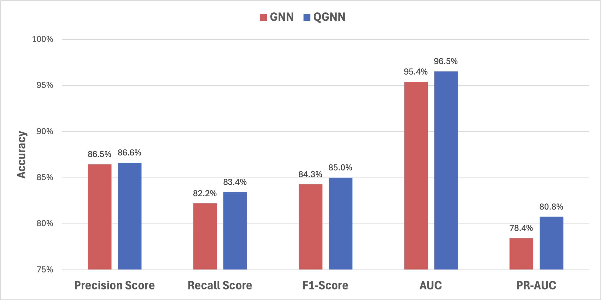
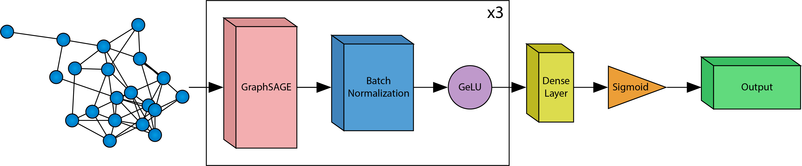
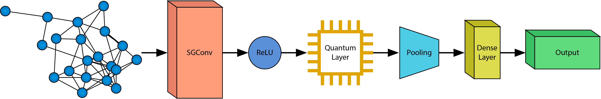
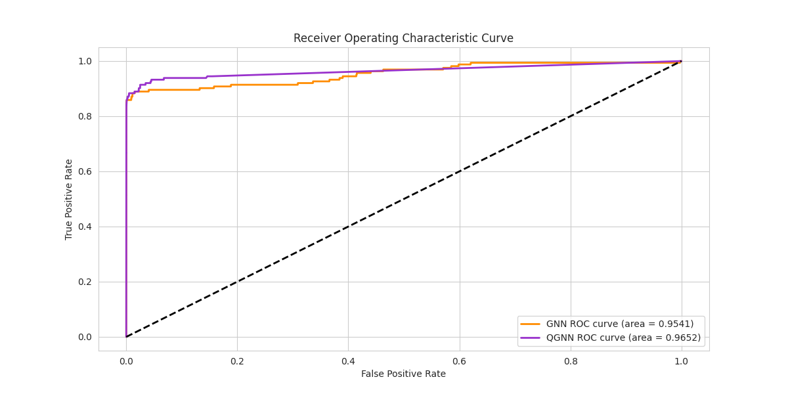
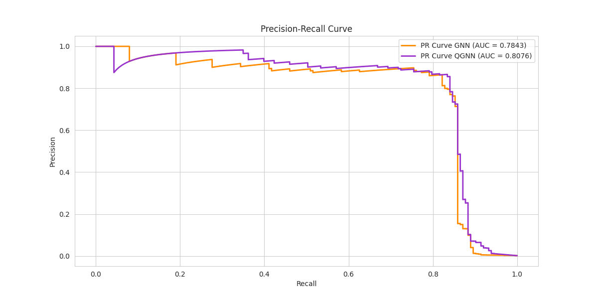

<!-- markdownlint-disable first-line-h1 -->
<!-- markdownlint-disable html -->
<!-- markdownlint-disable no-duplicate-header -->

  

---

   <a href="mailto:erik.staszewski@gmail.com"><b>Email Me</b></a> | <a href="https://www.linkedin.com/in/estaszewski/"><b>My LinkedIn</b></a> | <a href="https://equal1.com/"><b>Equal1 Site</b></a>

## Work in Progress

This project is still WIP. Results may evolve as improvements are made. Feedback is welcome.

## 1. Introduction

This project, by Erik Staszewski under the supervision of David Redmond for Equal1, seeks to implement and extend quantum computing techniques for credit card fraud detection.

The project focuses on constructing a Graph Neural Network (GNN) and Quantum Graph Neural Network (QGNN) for binary classification of fraudulent and non-fraudulent credit card transactions. Results are measured and compared using precision, recall, and $F_1$-scores, and plotted using Receiver Operating Characteristic and Precision-Recall Curves.

  

## 2. Model Architecture

**GNN Model**

- Uses 3 GraphSAGE convolutional layers, each followed by batch normalization to stabilize training.
- Uses GeLU activation, enhancing non-linearity.
- The dense layer maps the embeddings to a single scalar output, followed by a sigmoid activation for binary fraud classification.
- Trained for 100 epochs, optimized using Adam with binary cross-entropy loss (BCELoss).
 

  

**QGNN Model**

- Uses a hybrid quantum-classical approach, incorporating an SGConv layer for initial feature extraction.
- Quantum computation is performed with a single-qubit quantum layer, consisting of RX and RY gates, followed by pooling and a fully connected layer.
- Uses ReLU activation before the quantum layer to maintain expressiveness in classical feature extraction.
- Training uses gradient-based updates with the parameter shift rule, ensuring proper backpropagation through the quantum circuit.
- Trained for 200 epochs, optimized using Adam with binary cross-entropy loss (BCELoss).

  

## 3. Results

| Metric | GNN (GraphSAGE) | QGNN (GCN) | QGNN (SGConv) |
|-------------------|--------|--------|--------|
| Precision Score | 0.8645 | **0.8671** | 0.8662 |
| Recall Score | 0.8221 | **0.8405** | 0.8344 |
| $F_1$ Score | 0.8428 | **0.8536** | 0.8500 |
| ROC AUC | 0.9541 | 0.9237 | **0.9652** |
| PR AUC | 0.7843 | 0.7851 | **0.8076** |

The charts below compare the GNN (GraphSAGE) results with the QGNN (SGConv) results. SGConv was chosen over GCN because it outperformed GNN in all five metrics, while GCN only outperformed GNN in three metrics.

  

  

